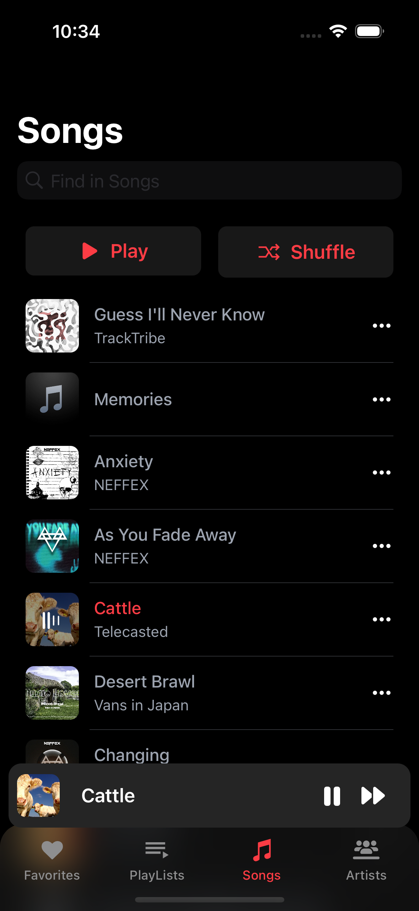
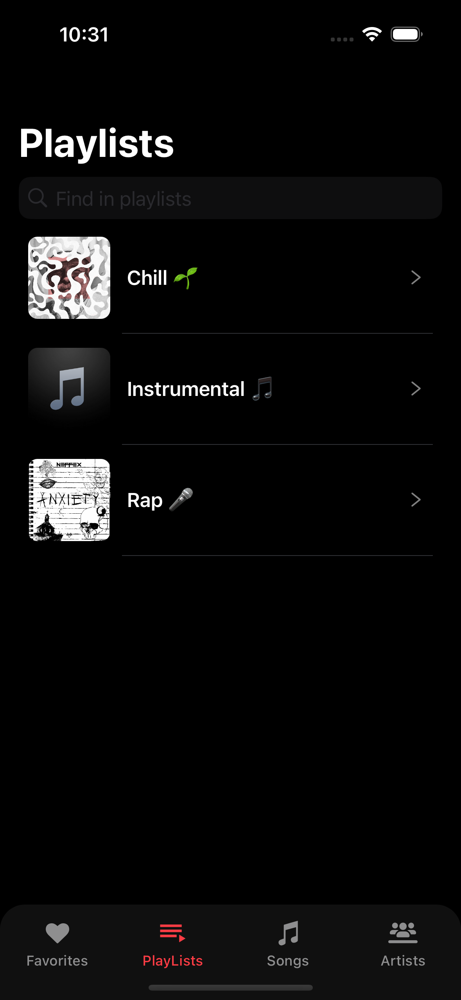
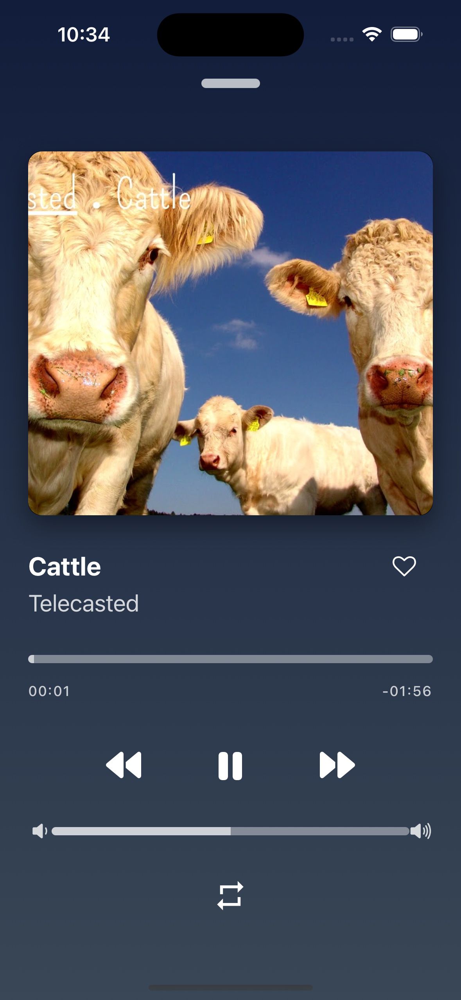

# 🎵 Music Player App

This **Music Player App** is designed to provide an intuitive and enjoyable music listening experience. Users can explore a list of songs, view favorites, playlists, and artists, see song details, and enjoy seamless music playback, even in the background.

🎧 **Built with React Native** and enhanced with animations and blur effects for a smooth and responsive user experience!

## 🚀 Features

- 🎶 **Song List:** Explore a curated list of songs.
- ❤️ **Favorites:** Easily mark and manage your favorite tracks.
- 🎛️ **Playlists & Artists:** View your playlists and artists.
- 📝 **Song Details:** Get more information about each track.
- ▶️ **Music Playback:** Play songs with background music support.

## 📸 Screenshots

<p align="center">
  
  
  
  
</p>

## 🛠️ Tech Stack

- **[Expo Router](https://expo.github.io/router/docs/):** 🧭 Navigation for managing routes.
- **[Expo Blur](https://docs.expo.dev/versions/latest/sdk/blur/):** 🌫️ Beautiful blur effects.
- **[Expo Linear Gradient](https://docs.expo.dev/versions/latest/sdk/linear-gradient/):** 🌈 Smooth linear gradients for UI enhancements.
- **[React Native Image Color](https://github.com/osamaq/react-native-image-colors):** 🎨 Extract colors from images.
- **[React Native Fast Image](https://github.com/DylanVann/react-native-fast-image):** 🚀 Optimized image loading.
- **[React Native Loader Kit](https://github.com/niyaztorabipour/react-native-loader-kit):** ⏳ Elegant loading animations.
- **[React Native Reanimated](https://docs.swmansion.com/react-native-reanimated/):** 🌀 For smooth and performant animations.
- **[React Native Size Matters](https://github.com/nirsky/react-native-size-matters):** 📐 Ensures responsive design across all devices.
- **[Zustand](https://zustand-demo.pmnd.rs/):** 🐻 Lightweight state management.
- **[React Native Track Player](https://github.com/DoubleSymmetry/react-native-track-player):** 🎧 Feature-rich music playback with background support.

## 📦 Setup and Installation

1. Clone the repository:
    ```bash
    git clone https://github.com/Htoomyat99/music-player
    ```

2. Install the dependencies:
    ```bash
    npm install
    ```

3. For iOS, run the app:
    ```bash
    npx expo run:ios
    ```

4. For Android, run the app:
    ```bash
    npx expo run:android
    ```

## 🎯 Functionality

- **Song List:** Browse the song catalog.
- **Favorites:** Manage your favorite tracks.
- **Playlists & Artists:** Organize and explore music by playlists and artists.
- **Song Detail:** See detailed info for each song.
- **Background Music:** Enjoy uninterrupted playback in the background.

## 🔗 Inspiration

This project is inspired by the following tutorial:  
[Music App Tutorial on YouTube](https://www.youtube.com/watch?v=9CElrkFwiBU&t=15312s)

## 📝 License

This project is licensed under the MIT License.

---

🎵 **Music that Moves You!** 🎵
